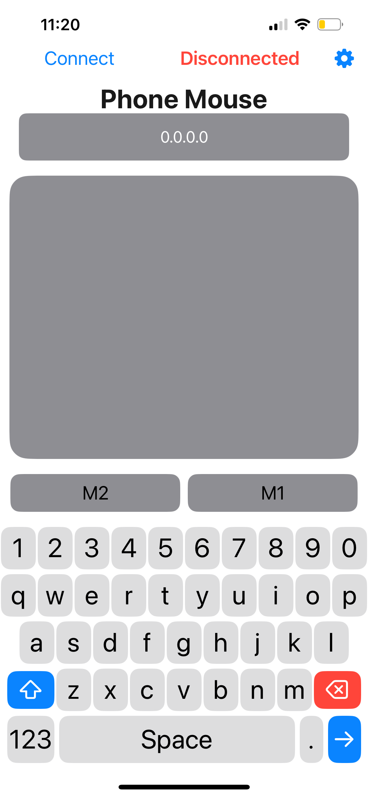
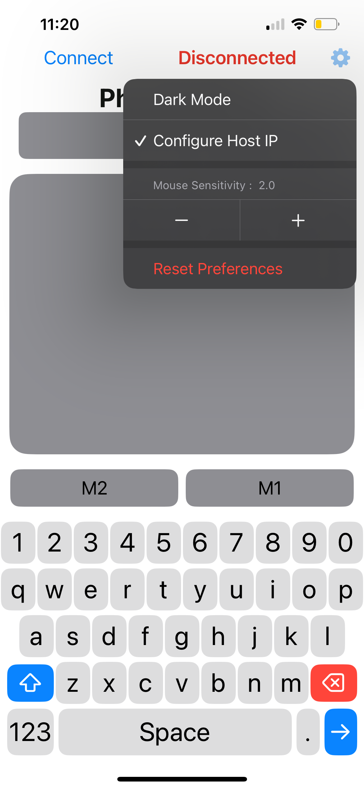
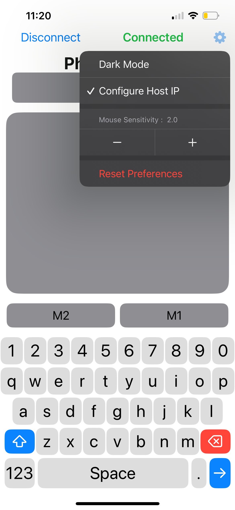
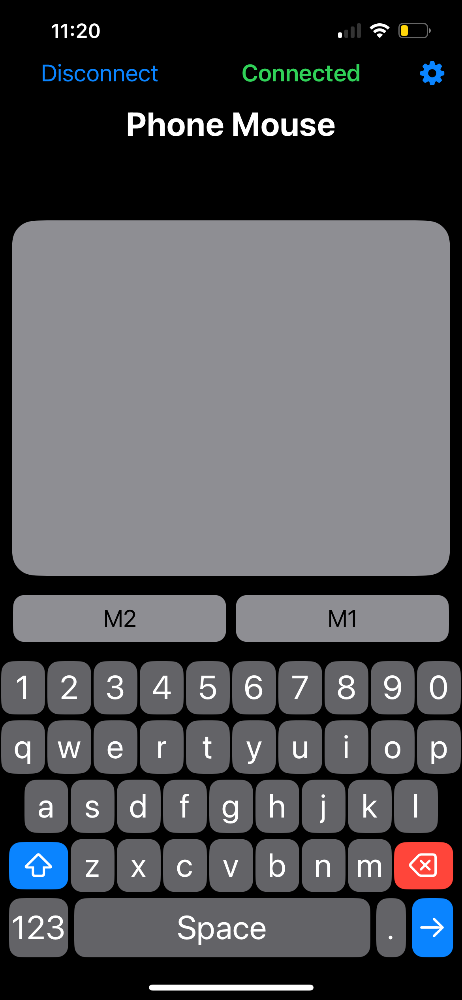

# PhoneMouseClient-iOS
PhoneMouseClient is a mobile application designed to control your Windows PC or Mac remotely via touch gestures, like mouse movement and clicks. The app communicates with a SignalR server to simulate mouse and keyboard interactions on your desktop or laptop.

# Features:
- **Mouse Control**: Transform your phone’s screen into a mouse pad, allowing you to move the cursor around your desktop with ease.
- **Clicking**: Simulate left and right mouse clicks by tapping anywhere on your mobile screen.
- **Customizable Sensitivity**: Fine-tune your mouse sensitivity for precise control and a personalized experience.
- **Dark Mode Support**: Toggle between light and dark modes
- **IP Configuration**: To connect to your app you must configure your target IP address by selecting **Configure Host IP**. The target IP is the local ipv4 address of the host machine you wish to connect to. If you are unsure how to find this you can open the [Server](https://github.com/therealguillermo/PhoneMouseHost) from the tray to find the host IP

# Requirements:
- **Mobile Device**: An iOS smartphone/tablet iOS 17+.
- **[SignalR Server](https://github.com/therealguillermo/PhoneMouseHost)**: A SignalR server running on your Windows PC that listens for mouse and keyboard inputs. You can easily set up the server using the provided server-side code.
- **Network**: Ensure that both your mobile device and PC are connected to the same Wi-Fi network.

# Installation and Setup:

### (Xcode):
    1. Clone the repository to your local machine.
    2. Open the `PhoneMouseClient.xcodeproj` file in Xcode.
    3. Connect your iOS device to your Mac.
    4. Build and run the app on your device to start controlling your PC/Mac. This will download the app to your device for 7 days.
    5. (Optional) You may need to enable Developer Mode and verify the application in order for it to open.
    6. Once the build is complete you should configure your host IP address to connect and control your PC

### (Other install methods to be added...)

